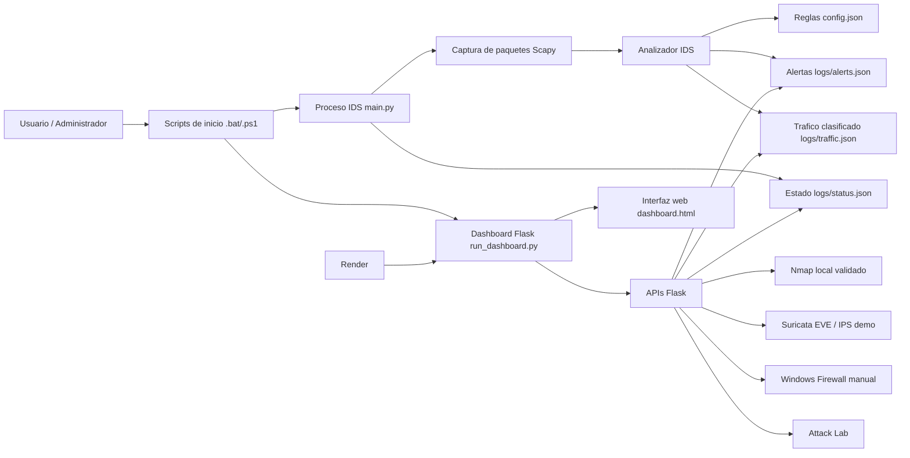
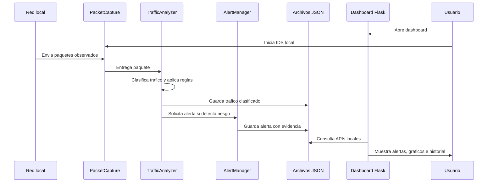
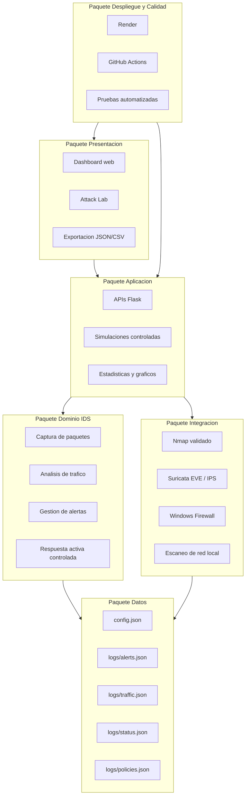
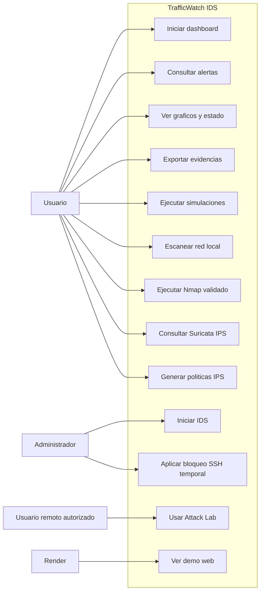
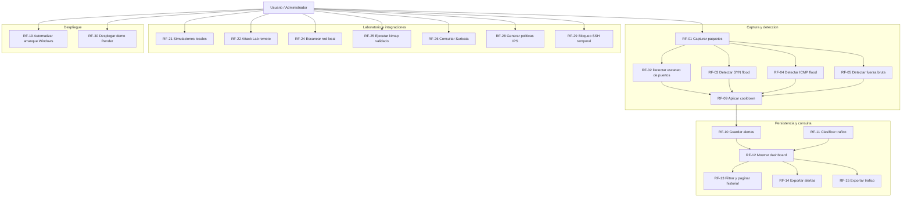
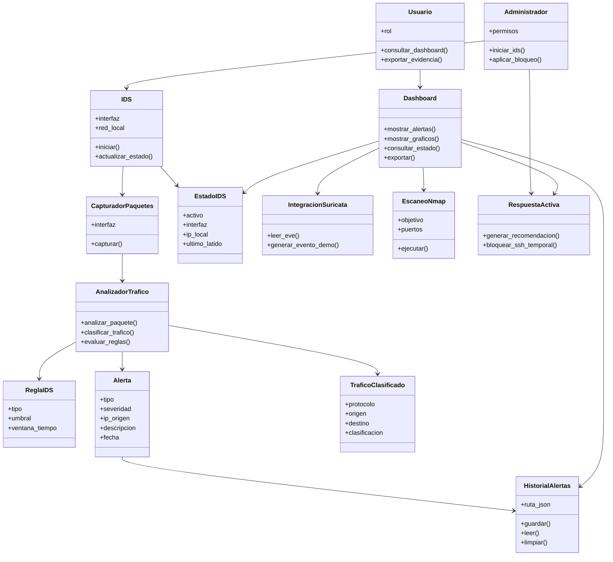

**UNIVERSIDAD PRIVADA DE TACNA**

**FACULTAD DE INGENIERIA**

**Escuela Profesional de Ingenieria de Sistemas**

**Proyecto TrafficWatch IDS**

Curso: **Calidad y Pruebas de Software**

Docente: **MAG. Patrick Cuadros Quiroga**

Integrantes:

- **Edgar Diego Chara Apaza (2019065026)**
- **Abel Fernando Pacompia Ortiz (2023076797)**

**Tacna - Peru**

**2026**

\pagebreak

# Informe de Especificacion de Requerimientos

Version: **2.4**

| Version | Hecha por | Revisada por | Aprobada por | Fecha | Motivo |
|:--:|:--:|:--:|:--:|:--:|:--|
| 1.0 | APO, ECA | APO, ECA | P. Cuadros Q. | 2026-04-20 | Version inicial |
| 2.0 | APO, ECA | APO, ECA | P. Cuadros Q. | 2026-06-09 | Actualizacion segun implementacion final |
| 2.1 | APO, ECA | APO, ECA | P. Cuadros Q. | 2026-07-04 | Actualizacion segun codigo actual, APIs Flask, Render, Suricata IPS y respuesta activa |
| 2.2 | APO, ECA | APO, ECA | P. Cuadros Q. | 2026-07-04 | Se agrega representacion de la arquitectura del sistema |
| 2.3 | APO, ECA | APO, ECA | P. Cuadros Q. | 2026-07-04 | Se agrega modelo conceptual con paquetes y casos de uso |
| 2.4 | APO, ECA | APO, ECA | P. Cuadros Q. | 2026-07-04 | Se agrega modelo logico y analisis de objetos |

## 1. Introduccion

Este documento especifica los requerimientos funcionales y no funcionales de **TrafficWatch IDS**, sistema de deteccion de intrusos para monitoreo de trafico de red en Windows.

## 2. Alcance funcional

El sistema permite:

- Capturar paquetes de red.
- Analizar trafico con reglas IDS.
- Generar alertas.
- Guardar historial.
- Clasificar trafico.
- Mostrar dashboard web.
- Exportar informacion.
- Ejecutar pruebas guiadas.
- Agrupar alertas como incidentes.
- Ejecutar simulaciones locales y remotas controladas.
- Escanear dispositivos de red local bajo limites configurables.
- Ejecutar Nmap local con validacion de objetivo y puertos permitidos.
- Consultar eventos Suricata EVE y generar alertas demo.
- Generar politicas IPS y comandos de bloqueo sugeridos.
- Aplicar bloqueo temporal manual en Windows Firewall para alertas SSH validas.
- Publicar una demo web en Render con funciones locales limitadas o simuladas.

El sistema no reemplaza herramientas empresariales de seguridad ni debe ejecutar acciones ofensivas. La respuesta activa es defensiva, local, temporal y requiere autorizacion.

## 3. Representacion de la arquitectura del sistema

La arquitectura de **TrafficWatch IDS** se organiza en capas para separar la captura de trafico, el analisis IDS, la persistencia, la visualizacion web y los servicios de apoyo. Esta separacion permite que el sistema funcione en modo local con captura real y tambien como demo web en Render con funciones simuladas o limitadas.

### 3.1 Capas de la arquitectura

| Capa | Componentes | Responsabilidad |
|---|---|---|
| Presentacion | `web/templates/dashboard.html`, `attack_lab.html` | Muestra alertas, graficos, historial, estado del IDS, reglas y laboratorio de pruebas. |
| API web | `web/app.py` | Expone endpoints Flask para consultar datos, exportar informacion y ejecutar acciones controladas. |
| Deteccion IDS | `main.py`, `src/packet_capture.py`, `src/analyzer.py` | Captura paquetes, clasifica trafico y evalua reglas de deteccion. |
| Gestion de alertas | `src/alert_manager.py`, `src/response_actions.py` | Genera alertas, aplica cooldown y prepara respuestas defensivas. |
| Persistencia | `src/storage.py`, archivos `logs/*.json` | Guarda alertas, trafico, estado y politicas para consulta posterior. |
| Integraciones | `src/real_scan.py`, `src/network_scanner.py`, `src/suricata_integration.py` | Ejecuta escaneos controlados, consulta Suricata EVE y genera politicas IPS. |
| Configuracion y despliegue | `config.json`, `render.yaml`, `runtime.txt`, workflows GitHub | Centraliza reglas, parametros, despliegue y automatizacion de calidad. |

### 3.2 Flujo principal del sistema

### 3.3 Consideraciones de despliegue

En ejecucion local, el sistema puede capturar trafico real con Scapy, usar Nmap, leer eventos Suricata y aplicar acciones manuales de firewall si el usuario tiene permisos de administrador. En Render, el dashboard se publica como demostracion academica y no ejecuta captura real de red, Nmap local, Suricata real ni Windows Firewall.

## 4. Requerimientos funcionales

| ID | Requerimiento | Prioridad | Evidencia |
|---|---|---|---|
| RF-01 | Capturar paquetes de red en tiempo real. | Alta | `main.py`, `src/packet_capture.py` |
| RF-02 | Detectar escaneo de puertos. | Alta | Regla `port_scan` en `config.json` |
| RF-03 | Detectar SYN flood. | Alta | Regla `syn_flood` |
| RF-04 | Detectar ICMP flood. | Media | Regla `icmp_flood` |
| RF-05 | Detectar fuerza bruta hacia FTP, SSH, Telnet y RDP. | Alta | Regla `brute_force` |
| RF-06 | Detectar alta frecuencia de conexiones. | Media | Regla `connection_frequency` |
| RF-07 | Detectar puertos sospechosos. | Media | Regla `suspicious_ports` |
| RF-08 | Detectar puertos raros configurados. | Media | Regla `rare_ports` |
| RF-09 | Aplicar cooldown para alertas repetidas. | Alta | `src/alert_manager.py` |
| RF-10 | Guardar alertas en JSON. | Alta | `logs/alerts.json` |
| RF-11 | Clasificar trafico observado. | Media | `logs/traffic.json` |
| RF-12 | Mostrar dashboard web local. | Alta | `web/app.py`, `dashboard.html` |
| RF-13 | Filtrar y paginar historial. | Media | Seccion Historial |
| RF-14 | Exportar alertas en JSON y CSV. | Media | `/api/export/alerts.*` |
| RF-15 | Exportar trafico clasificado en JSON y CSV. | Media | `/api/export/traffic.*` |
| RF-16 | Mostrar estado del IDS. | Media | `/api/status`, `logs/status.json` |
| RF-17 | Mostrar graficos de alertas. | Media | `/api/charts` |
| RF-18 | Generar ejemplos de pruebas segun la red detectada. | Media | `src/network_utils.py` |
| RF-19 | Automatizar arranque con scripts Windows. | Alta | Archivos `.bat` y `.ps1` |
| RF-20 | Agrupar alertas repetidas como incidentes. | Media | `/api/incidents` |
| RF-21 | Ejecutar simulaciones locales de ataques controlados. | Media | `/api/simulate/<attack_type>` |
| RF-22 | Registrar eventos remotos desde Attack Lab. | Media | `/attack-lab`, `/api/remote-attack/<attack_type>` |
| RF-23 | Registrar trafico remoto controlado desde laboratorio. | Media | `/api/remote-lab-traffic/<traffic_type>` |
| RF-24 | Escanear dispositivos activos de la red local con limites configurables. | Media | `src/network_scanner.py`, `/api/network/devices` |
| RF-25 | Ejecutar Nmap local validado. | Media | `src/real_scan.py`, `/api/real-scan/nmap` |
| RF-26 | Consultar estado y alertas de Suricata EVE. | Media | `/api/suricata/status`, `/api/suricata/alerts` |
| RF-27 | Generar evento demo Suricata. | Baja | `/api/suricata/demo-alert` |
| RF-28 | Generar comandos y politicas IPS. | Media | `/api/ips/*`, `src/suricata_integration.py` |
| RF-29 | Aplicar bloqueo temporal SSH bajo validacion. | Media | `/api/firewall/block-ssh-ip`, `src/response_actions.py` |
| RF-30 | Desplegar dashboard de demostracion en Render. | Media | `render.yaml`, `runtime.txt` |

## 5. Requerimientos no funcionales

### 5.1 Resumen de requerimientos no funcionales

| ID | Requerimiento | Criterio |
|---|---|---|
| RNF-01 | Usabilidad | El usuario puede iniciar dashboard, IDS y pruebas mediante `.bat`. |
| RNF-02 | Rendimiento | El IDS procesa trafico moderado de laboratorio en tiempo real. |
| RNF-03 | Mantenibilidad | El codigo se organiza en modulos separados. |
| RNF-04 | Configurabilidad | Reglas y umbrales se definen en `config.json`. |
| RNF-05 | Auditabilidad | Alertas y trafico quedan en JSON y pueden exportarse. |
| RNF-06 | Seguridad de uso | El sistema documenta que debe ejecutarse solo en redes autorizadas. |
| RNF-07 | Compatibilidad | Enfoque principal en Windows. |
| RNF-08 | Disponibilidad local | Dashboard disponible en `http://127.0.0.1:5000` cuando `run_dashboard.py` esta activo. |
| RNF-09 | Compatibilidad Render | La demo web no debe depender de captura real, Nmap real, Suricata real ni Windows Firewall. |
| RNF-10 | Seguridad operativa | Las acciones de red, firewall y escaneo deben estar limitadas a entornos autorizados. |
| RNF-11 | Tolerancia a datos | El dashboard debe tolerar listas vacias, campos nulos y logs JSON corruptos o ausentes. |
| RNF-12 | Escalabilidad de laboratorio | El escaneo de red debe usar limites de hosts, trabajadores, timeouts y cache. |

### 5.2 Modelo Conceptual

El modelo conceptual representa los paquetes principales del sistema y la relacion entre actores, funcionalidades y requerimientos. Los diagramas permiten observar el alcance funcional de TrafficWatch IDS antes de pasar al detalle tecnico de implementacion.

#### 5.2.1 Diagrama de Paquetes

#### 5.2.2 Diagrama de Casos de Uso

##### Diagrama General

##### Diagrama por Requerimientos

### 5.3 Modelo Logico

El modelo logico describe los objetos principales que participan en TrafficWatch IDS y la forma en que se relacionan durante la captura, analisis, registro y visualizacion de eventos. Este modelo ayuda a pasar de los requerimientos hacia una estructura entendible para el diseno e implementacion.

#### 5.3.1 Analisis de Objetos

| Objeto | Tipo | Responsabilidad | Datos principales | Relacion |
|---|---|---|---|---|
| Usuario | Actor | Opera el dashboard y consulta resultados. | Nombre de usuario, rol, acciones solicitadas. | Interactua con Dashboard, Attack Lab y Exportacion. |
| Administrador | Actor | Inicia captura real y acciones defensivas con permisos. | Rol administrador, permisos del sistema. | Ejecuta IDS, Nmap validado y bloqueo temporal. |
| Dashboard | Objeto de interfaz | Presenta alertas, graficos, historial, estado y acciones. | Filtros, pagina actual, datos de APIs. | Consulta Alertas, Trafico, Estado e Integraciones. |
| IDS | Objeto de control | Coordina captura, analisis y estado operativo. | Interfaz, red local, estado de ejecucion. | Usa Capturador, Analizador y Estado. |
| CapturadorPaquetes | Objeto tecnico | Captura paquetes desde la interfaz de red. | Interfaz, paquete observado, callback. | Entrega paquetes al Analizador. |
| AnalizadorTrafico | Objeto de dominio | Clasifica trafico y evalua reglas IDS. | IP origen, IP destino, protocolo, puerto, regla activada. | Genera TraficoClasificado y solicita Alertas. |
| ReglaIDS | Objeto de configuracion | Define umbrales y condiciones de deteccion. | Tipo de regla, umbral, ventana de tiempo, puertos. | Es usada por AnalizadorTrafico. |
| Alerta | Objeto de dominio | Representa un evento sospechoso detectado. | Tipo, severidad, IP origen, descripcion, fecha. | Se guarda en HistorialAlertas. |
| TraficoClasificado | Objeto de dominio | Registra trafico observado y su categoria. | Protocolo, origen, destino, puerto, clasificacion. | Se guarda para visualizacion y exportacion. |
| EstadoIDS | Objeto de estado | Informa si el IDS esta activo y que red monitorea. | Activo, interfaz, IP local, gateway, ultimo latido. | Es consultado por Dashboard. |
| HistorialAlertas | Objeto de persistencia | Almacena y devuelve alertas en JSON. | Lista de alertas, ruta `logs/alerts.json`. | Es consultado por Dashboard y Exportacion. |
| IntegracionSuricata | Objeto de integracion | Lee eventos EVE y genera datos IPS de demostracion. | Ruta EVE, reglas locales, politicas IPS. | Se consulta desde Dashboard. |
| EscaneoNmap | Objeto de integracion | Ejecuta escaneo local validado. | Objetivo, puertos permitidos, resultado. | Puede generar alertas controladas. |
| RespuestaActiva | Objeto de servicio | Genera recomendaciones y bloqueo SSH temporal autorizado. | IP objetivo, tipo de alerta, duracion. | Se asocia con Alerta y Administrador. |
| DespliegueRender | Objeto de despliegue | Publica una demo web sin captura real. | URL publica, build command, start command. | Expone Dashboard en modo demostracion. |

## 6. Reglas de negocio IDS

| Regla | Descripcion |
|---|---|
| ESCANEO_DE_PUERTOS | Una IP accede a varios puertos distintos en una ventana corta. |
| SYN_FLOOD | Exceso de paquetes TCP SYN desde una misma IP. |
| ICMP_FLOOD | Exceso de paquetes ICMP desde una misma IP. |
| FUERZA_BRUTA_* | Intentos repetidos hacia servicios comunes. |
| ALTA_FRECUENCIA_CONEXIONES | Muchas conexiones TCP desde una misma IP aunque no sean a muchos puertos. |
| PUERTO_SOSPECHOSO | Conexion hacia puertos sensibles configurados. |
| PUERTO_RARO | Conexion hacia puertos poco comunes configurados. |
| ESCANEO_REAL_NMAP | Escaneo Nmap solicitado desde el dashboard y clasificado por riesgo. |
| TRAFICO_REAL_LAB_* | Trafico controlado registrado desde Attack Lab. |
| POLITICA_BLOQUEO_YOUTUBE | Politica IPS generada para restringir YouTube por IP. |
| BLOQUEO_TEMPORAL_SSH | Registro de bloqueo temporal aplicado ante alerta SSH valida. |

## 7. Casos de uso

| Caso | Actor | Flujo principal |
|---|---|---|
| CU-01 Iniciar dashboard | Usuario | Ejecuta `abrir_cmd_proyecto.bat` y abre localhost. |
| CU-02 Iniciar IDS | Usuario | Ejecuta `abrir_powershell_admin.bat`, acepta permisos y deja capturando. |
| CU-03 Ejecutar pruebas | Usuario | Abre `abrir_powershell_pruebas.bat` y ejecuta ejemplos sugeridos. |
| CU-04 Consultar alertas | Usuario | Revisa dashboard e historial. |
| CU-05 Exportar informacion | Usuario | Descarga JSON o CSV de alertas/trafico. |
| CU-06 Revisar estado IDS | Usuario | Entra a seccion Estado IDS. |
| CU-07 Analizar graficos | Usuario | Entra a seccion Graficos. |
| CU-08 Ejecutar Attack Lab | Usuario remoto autorizado | Ingresa a `/attack-lab` y genera eventos controlados. |
| CU-09 Escanear red local | Usuario | Usa el boton de escaneo para listar dispositivos activos. |
| CU-10 Ejecutar Nmap local | Usuario | Ingresa objetivo autorizado y rango permitido desde el dashboard. |
| CU-11 Revisar Suricata IPS | Usuario | Consulta estado, alertas EVE y genera evento demo. |
| CU-12 Generar politica IPS | Usuario | Genera comandos o reglas Suricata y guarda politicas. |
| CU-13 Bloquear IP SSH | Usuario administrador | Aplica bloqueo temporal a una IP con alerta SSH registrada. |

## 8. Interfaces

### 8.1 Interfaz web

Secciones implementadas:

- Dashboard.
- Tipos de trafico.
- Trafico clasificado.
- Estado IDS.
- Graficos.
- Historial.
- Reglas IDS.
- Escaneo de red.
- Suricata IPS.
- Politicas IPS.
- Attack Lab.

### 8.2 API local Flask

| Ruta | Funcion |
|---|---|
| `/api/alerts` | Lista alertas. |
| `/api/incidents` | Lista incidentes agrupados desde alertas repetidas. |
| `/api/traffic` | Lista trafico clasificado. |
| `/api/status` | Devuelve estado del IDS. |
| `/api/charts` | Devuelve datos para graficos. |
| `/api/stats` | Devuelve resumen estadistico de alertas. |
| `/api/network/devices` | Ejecuta o devuelve escaneo controlado de red local. |
| `/api/real-scan/nmap` | Ejecuta Nmap local validado. |
| `/api/suricata/status` | Devuelve estado de EVE JSON y reglas Suricata. |
| `/api/suricata/alerts` | Devuelve alertas normalizadas desde Suricata EVE. |
| `/api/suricata/demo-alert` | Genera evento EVE de demostracion. |
| `/api/ips/block-command` | Genera comandos de bloqueo para firewall/Suricata. |
| `/api/ips/inline-plan` | Genera plan de laboratorio IPS inline. |
| `/api/ips/youtube-policy` | Devuelve politica sugerida para YouTube. |
| `/api/ips/youtube-block-command` | Genera reglas Suricata para YouTube por IP. |
| `/api/ips/youtube-policy/save` | Guarda politica IPS generada. |
| `/api/ips/policies` | Lista politicas IPS guardadas. |
| `/api/firewall/block-ssh-ip` | Aplica bloqueo temporal SSH si existe alerta valida. |
| `/api/simulate/<attack_type>` | Genera alerta local simulada. |
| `/api/remote-attack/<attack_type>` | Registra ataque remoto simulado. |
| `/api/remote-lab-traffic/<traffic_type>` | Registra trafico remoto controlado. |
| `/api/clear` | Borra historial de alertas. |
| `/api/export/alerts.json` | Exporta alertas JSON. |
| `/api/export/alerts.csv` | Exporta alertas CSV. |
| `/api/export/traffic.json` | Exporta trafico JSON. |
| `/api/export/traffic.csv` | Exporta trafico CSV. |

## 9. Criterios de aceptacion

- El dashboard abre en `http://127.0.0.1:5000`.
- El IDS captura paquetes al ejecutarse como administrador.
- Las pruebas de Nmap generan alertas de escaneo cuando superan el umbral.
- `simular_fuerza_bruta.py` genera alertas de fuerza bruta cuando alcanza el umbral.
- El historial permite filtrar, paginar y borrar alertas.
- Los graficos se actualizan con el historial.
- Los archivos JSON/CSV se descargan correctamente.
- `/attack-lab` registra eventos remotos controlados y muestra la IP origen.
- El escaneo de red local respeta limites de `config.json`.
- Nmap local rechaza objetivos fuera de la red detectada y rangos no permitidos.
- La vista Suricata funciona con archivo EVE ausente o presente.
- Las politicas IPS se generan y guardan sin aplicar cambios reales automaticamente.
- El bloqueo SSH solo procede si existe una alerta SSH para la IP indicada.
- Render muestra la demo sin depender de Nmap, Suricata real, Scapy o Windows Firewall.

## 10. Conclusiones

Los requerimientos actuales reflejan una version funcional del IDS academico. El proyecto evoluciono desde una captura basica con alertas hacia una herramienta con dashboard completo, reglas ampliadas, estado operativo, clasificacion de trafico, incidentes, graficos, exportaciones, Attack Lab, Suricata IPS, politicas de respuesta, despliegue Render y automatizacion para Windows.
