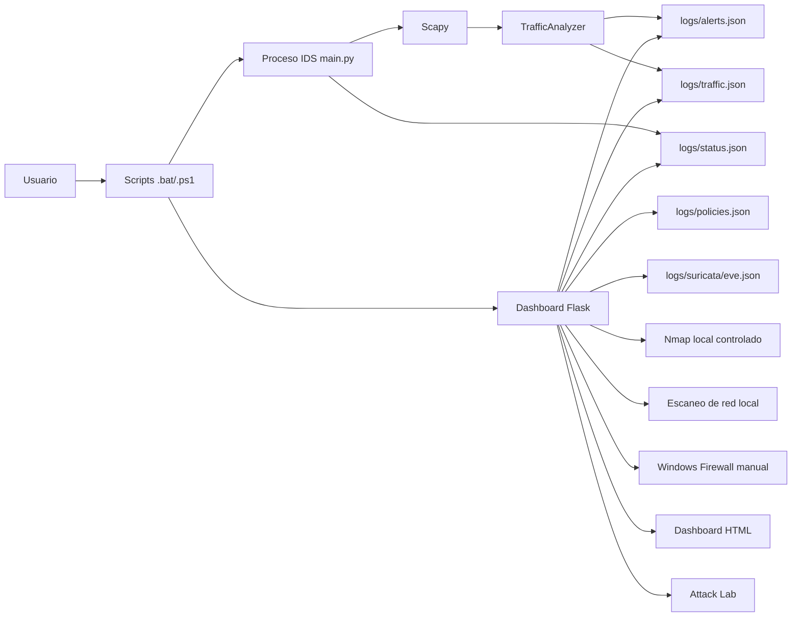
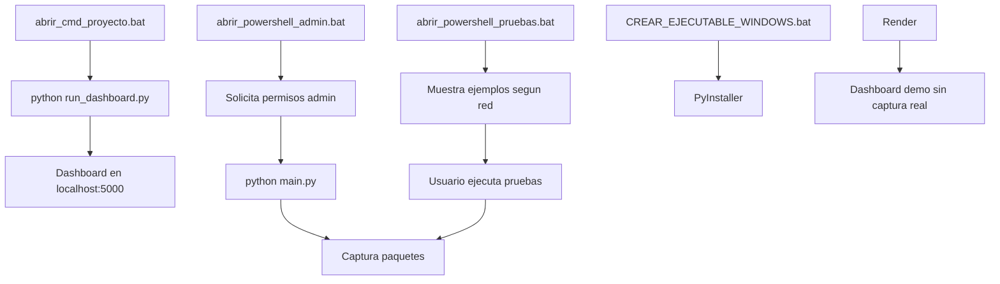
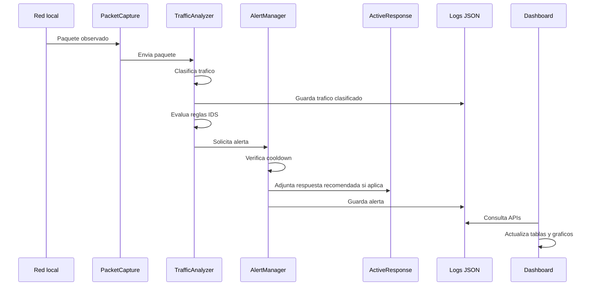
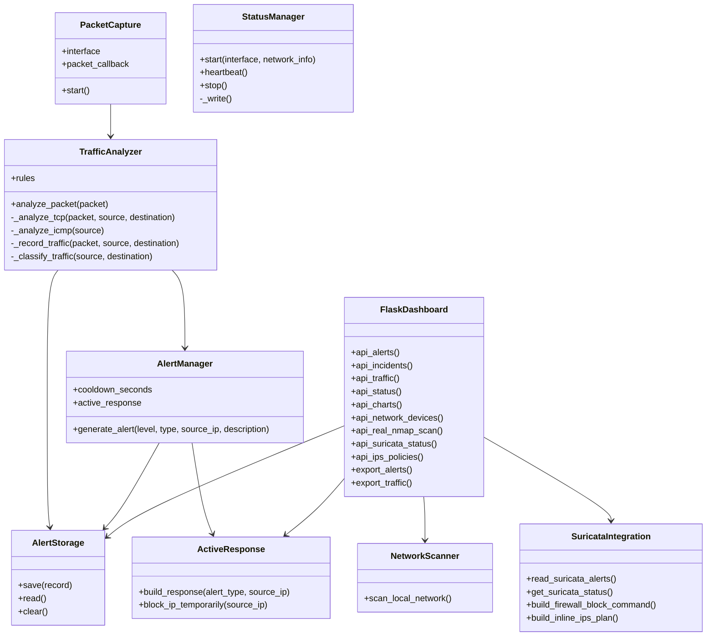
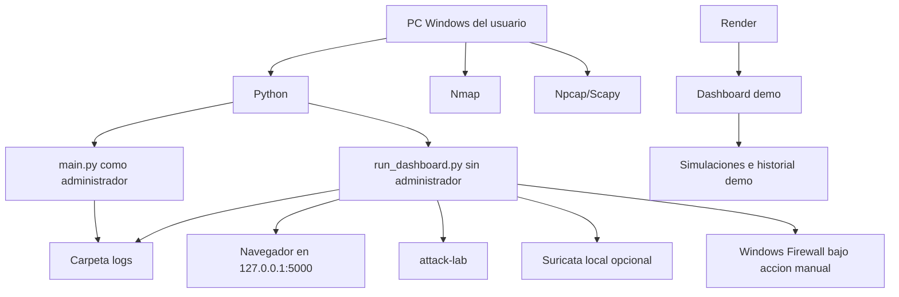

**UNIVERSIDAD PRIVADA DE TACNA**

**FACULTAD DE INGENIERIA**

**Escuela Profesional de Ingenieria de Sistemas**

**Proyecto TrafficWatch IDS**

Curso: **Calidad y Pruebas de Software**

Docente: **MAG. Patrick Cuadros Quiroga**

Integrantes:

- **Edgar Diego Chara Apaza (2019065026)**
- **Abel Fernando Pacompia Ortiz (2023076797)**

**Tacna - Peru**

**2026**

\pagebreak

# Informe de Arquitectura de Software

Version: **2.1**

| Version | Hecha por | Revisada por | Aprobada por | Fecha | Motivo |
|:--:|:--:|:--:|:--:|:--:|:--|
| 1.0 | APO, ECA | APO, ECA | P. Cuadros Q. | 2026-04-25 | Version inicial |
| 2.0 | APO, ECA | APO, ECA | P. Cuadros Q. | 2026-06-09 | Actualizacion segun implementacion final |
| 2.1 | APO, ECA | APO, ECA | P. Cuadros Q. | 2026-07-04 | Actualizacion segun dashboard, Suricata IPS, respuesta activa y despliegue Render |

## 1. Introduccion

Este documento describe la arquitectura de **TrafficWatch IDS**, sistema de deteccion de intrusos construido con Python, Scapy y Flask para ejecucion local en Windows y demostracion web en Render.

La arquitectura separa el proceso local de captura/analisis del proceso web de visualizacion. Ambos comparten archivos JSON como mecanismo simple de persistencia. El dashboard tambien incorpora simulaciones, escaneo local controlado, integracion con Suricata EVE, politicas IPS y respuesta activa manual para escenarios autorizados.

## 2. Vista general

## 3. Componentes

| Componente | Archivo | Responsabilidad |
|---|---|---|
| Programa principal | `main.py` | Carga configuracion, detecta red, inicia captura y estado IDS. |
| Captura | `src/packet_capture.py` | Captura paquetes con Scapy. |
| Analizador | `src/analyzer.py` | Clasifica trafico y aplica reglas IDS. |
| Alertas | `src/alert_manager.py` | Genera alertas y aplica cooldown. |
| Persistencia | `src/storage.py` | Lee, guarda y limpia archivos JSON. |
| Red | `src/network_utils.py` | Detecta IP, gateway, red y genera ejemplos de prueba. |
| Estado | `src/status_manager.py` | Escribe estado operativo del IDS. |
| Escaneo de red | `src/network_scanner.py` | Detecta dispositivos activos de la red local con ping sweep y tabla ARP. |
| Escaneo Nmap | `src/real_scan.py` | Ejecuta Nmap local con objetivo validado y rangos de puertos permitidos. |
| Respuesta activa | `src/response_actions.py` | Genera recomendaciones y aplica bloqueo temporal de IP cuando se solicita con permisos. |
| Suricata IPS | `src/suricata_integration.py` | Lee EVE JSON, genera eventos demo, comandos firewall, reglas drop y planes IPS inline. |
| Dashboard | `web/app.py` | Expone rutas Flask y APIs locales. |
| Interfaz | `web/templates/dashboard.html` | Renderiza dashboard, tablas, graficos y acciones. |
| Laboratorio web | `web/templates/attack_lab.html` | Permite trafico remoto controlado y pruebas autorizadas. |
| Simulador | `simular_fuerza_bruta.py` | Genera conexiones TCP repetidas para laboratorio. |
| Configuracion | `config.json` | Centraliza interfaz, reglas IDS, logs, dashboard, Suricata, escaneo y respuesta activa. |
| Despliegue Render | `render.yaml`, `runtime.txt` | Publican el dashboard de demostracion sin captura real ni firewall local. |

## 4. Vista de procesos

### 4.1 Arranque recomendado

### 4.2 Flujo de deteccion

## 5. Vista logica

## 6. Vista de datos

El sistema usa persistencia en archivos JSON:

| Archivo | Contenido |
|---|---|
| `logs/alerts.json` | Historial de alertas IDS. |
| `logs/traffic.json` | Ultimos paquetes clasificados. |
| `logs/status.json` | Estado operativo del IDS. |
| `logs/policies.json` | Politicas IPS generadas desde el dashboard. |
| `logs/suricata/eve.json` | Eventos Suricata EVE reales o de demostracion. |
| `suricata/local.rules` | Reglas locales Suricata utilizadas como referencia IPS. |
| `config.json` | Configuracion de reglas IDS, dashboard, escaneo, Suricata y respuesta activa. |

Las alertas y el trafico clasificado tambien pueden exportarse a JSON y CSV desde el dashboard.

## 7. Vista web/API

| Ruta | Descripcion |
|---|---|
| `/` | Dashboard principal. |
| `/attack-lab` | Laboratorio web de trafico controlado. |
| `/api/alerts` | Alertas. |
| `/api/incidents` | Alertas agrupadas como incidentes activos. |
| `/api/traffic` | Trafico clasificado. |
| `/api/status` | Estado IDS. |
| `/api/charts` | Datos para graficos. |
| `/api/stats` | Resumen estadistico de alertas. |
| `/api/network/devices` | Escaneo controlado de dispositivos de la red local. |
| `/api/real-scan/nmap` | Escaneo Nmap local validado. |
| `/api/suricata/status` | Estado de eve.json y reglas Suricata. |
| `/api/suricata/alerts` | Alertas normalizadas desde Suricata EVE. |
| `/api/suricata/demo-alert` | Genera un evento EVE de demostracion. |
| `/api/ips/block-command` | Construye comandos de bloqueo para firewall o Suricata. |
| `/api/ips/inline-plan` | Genera plan de laboratorio IPS inline con NFQUEUE. |
| `/api/ips/youtube-policy` | Devuelve politica sugerida para YouTube. |
| `/api/ips/youtube-block-command` | Genera reglas Suricata para restringir YouTube por IP. |
| `/api/ips/youtube-policy/save` | Guarda una politica IPS generada. |
| `/api/ips/policies` | Lista politicas IPS guardadas. |
| `/api/firewall/block-ssh-ip` | Aplica bloqueo temporal SSH si existe alerta valida y permisos. |
| `/api/simulate/<attack_type>` | Genera alertas locales simuladas. |
| `/api/remote-attack/<attack_type>` | Registra ataque remoto simulado. |
| `/api/remote-lab-traffic/<traffic_type>` | Registra trafico remoto controlado desde Attack Lab. |
| `/api/clear` | Borrar historial. |
| `/api/export/alerts.json` | Exportar alertas JSON. |
| `/api/export/alerts.csv` | Exportar alertas CSV. |
| `/api/export/traffic.json` | Exportar trafico JSON. |
| `/api/export/traffic.csv` | Exportar trafico CSV. |

## 8. Despliegue

La ejecucion local permite captura de paquetes, escaneo de red, Nmap, Suricata local y bloqueo temporal del firewall si existen permisos. La ejecucion en Render es solo demostrativa: muestra dashboard, simulaciones, historial, graficos y laboratorio remoto, pero no captura paquetes locales, no ejecuta Nmap real, no modifica Windows Firewall y no opera Suricata real en la red del usuario.

## 9. Atributos de calidad

| Atributo | Decisiones arquitectonicas |
|---|---|
| Usabilidad | Scripts `.bat`, dashboard web y ejemplos automaticos. |
| Mantenibilidad | Separacion por modulos. |
| Auditabilidad | JSON y CSV exportable, historial de alertas, trafico clasificado y politicas IPS. |
| Rendimiento | Limite de trafico clasificado, cooldown de alertas, cache de escaneo de red y ventanas temporales configurables. |
| Seguridad | Ejecucion local controlada, confirmacion manual de bloqueo, validacion de IPs/rangos y recomendacion de redes autorizadas. |
| Configurabilidad | `config.json` centraliza reglas, umbrales, rutas de logs, escaneo, Suricata, dashboard y respuesta activa. |
| Portabilidad | Dashboard compatible con Windows local, ejecutable empaquetado y demostracion web en Render con funciones locales deshabilitadas o simuladas. |

## 10. Conclusiones

La arquitectura actual es adecuada para un IDS academico con ejecucion local y demostracion web. La separacion entre captura, analisis, almacenamiento, dashboard, Suricata IPS y respuesta activa permite evolucionar el sistema sin modificar todos los componentes a la vez. La solucion mantiene un alcance controlado: las funciones de captura, Nmap, Suricata real y firewall dependen del entorno local autorizado, mientras que Render se limita a visualizacion, simulaciones e historial demostrativo.
