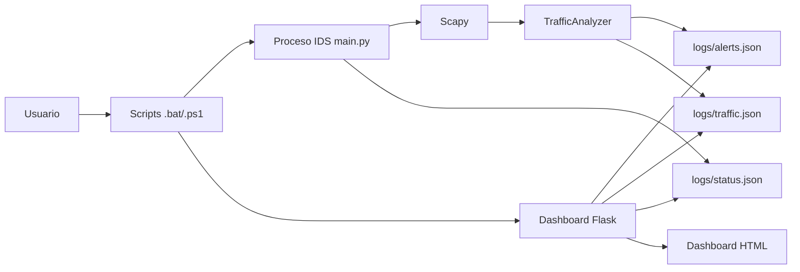
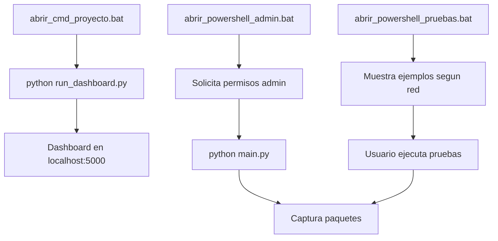
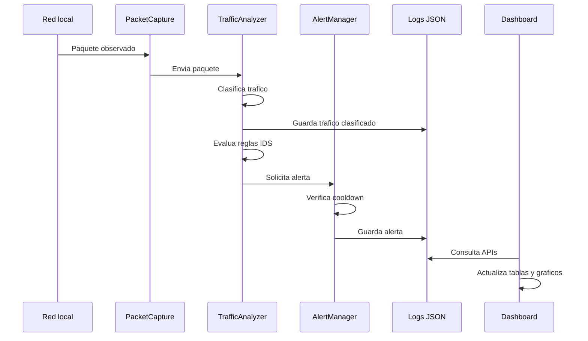
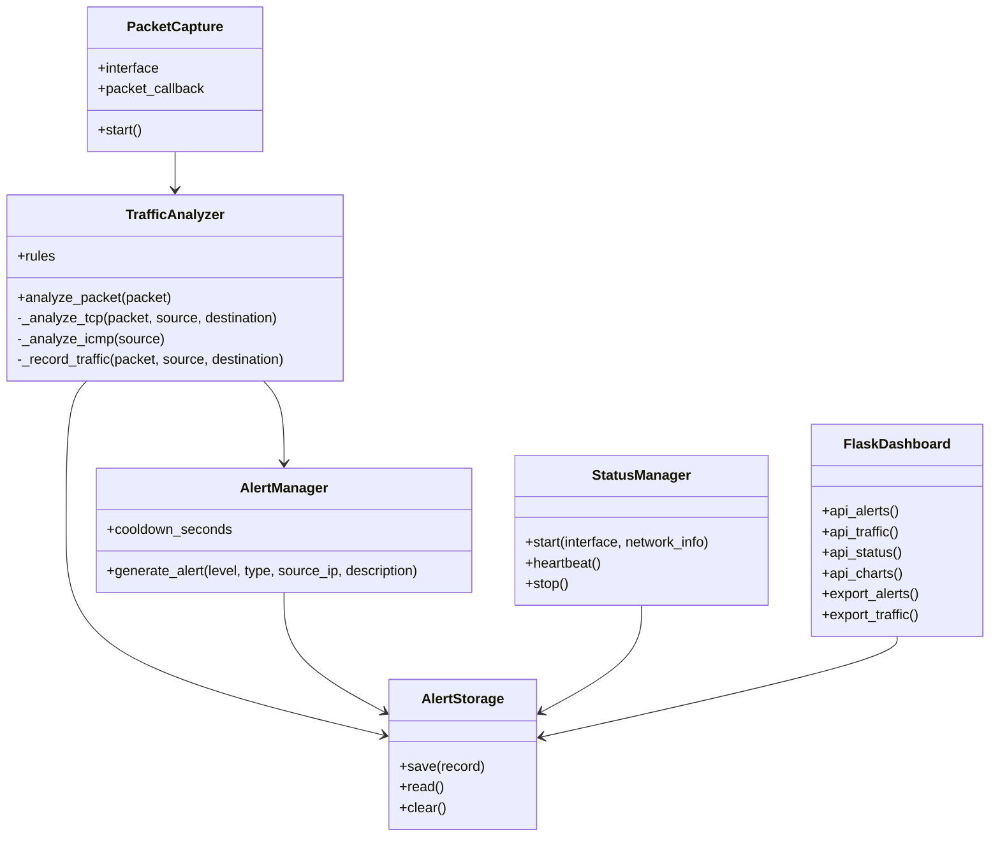
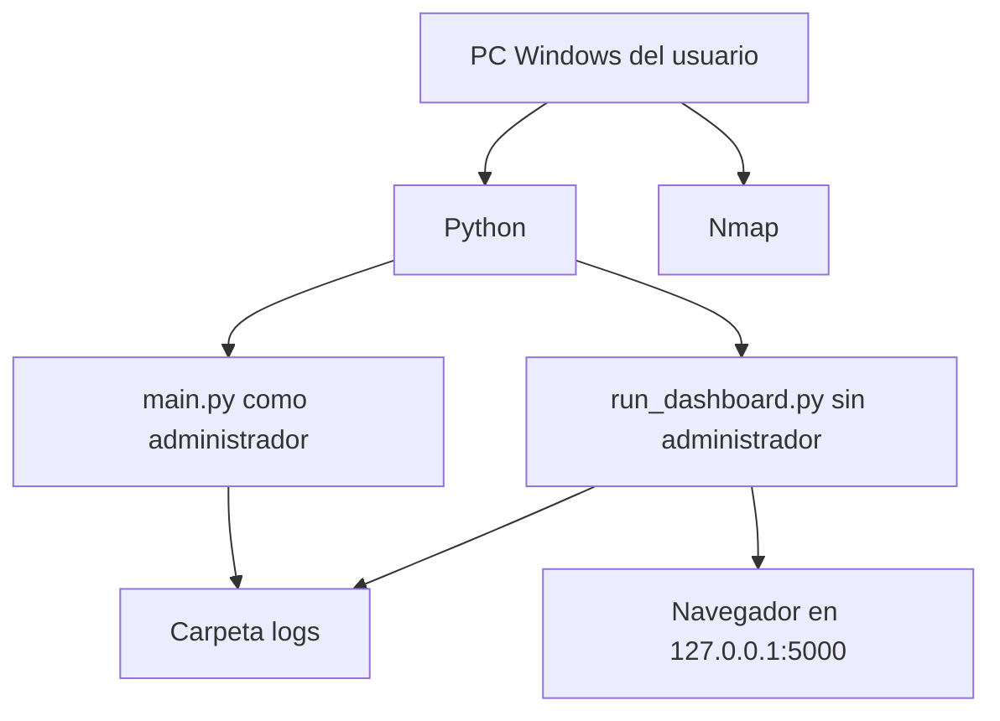

**UNIVERSIDAD PRIVADA DE TACNA**

**FACULTAD DE INGENIERIA**

**Escuela Profesional de Ingenieria de Sistemas**

**Proyecto TrafficWatch IDS**

Curso: **Calidad y Pruebas de Software**

Docente: **MAG. Patrick Cuadros Quiroga**

Integrantes:

- **Edgar Diego Chara Apaza (2019065026)**
- **Abel Fernando Pacompia Ortiz (2023076797)**

**Tacna - Peru**

**2026**

\pagebreak

# Informe de Arquitectura de Software

Version: **2.0**

| Version | Hecha por | Revisada por | Aprobada por | Fecha | Motivo |
|:--:|:--:|:--:|:--:|:--:|:--|
| 1.0 | APO, ECA | APO, ECA | P. Cuadros Q. | 2026-04-25 | Version inicial |
| 2.0 | APO, ECA | APO, ECA | P. Cuadros Q. | 2026-06-09 | Actualizacion segun implementacion final |

## 1. Introduccion

Este documento describe la arquitectura de **TrafficWatch IDS**, sistema local de deteccion de intrusos construido con Python, Scapy y Flask.

La arquitectura separa el proceso de captura/analisis del proceso web de visualizacion. Ambos comparten archivos JSON como mecanismo simple de persistencia.

## 2. Vista general

## 3. Componentes

| Componente | Archivo | Responsabilidad |
|---|---|---|
| Programa principal | `main.py` | Carga configuracion, detecta red, inicia captura y estado IDS. |
| Captura | `src/packet_capture.py` | Captura paquetes con Scapy. |
| Analizador | `src/analyzer.py` | Clasifica trafico y aplica reglas IDS. |
| Alertas | `src/alert_manager.py` | Genera alertas y aplica cooldown. |
| Persistencia | `src/storage.py` | Lee, guarda y limpia archivos JSON. |
| Red | `src/network_utils.py` | Detecta IP, gateway, red y genera ejemplos de prueba. |
| Estado | `src/status_manager.py` | Escribe estado operativo del IDS. |
| Dashboard | `web/app.py` | Expone rutas Flask y APIs locales. |
| Interfaz | `web/templates/dashboard.html` | Renderiza dashboard, tablas, graficos y acciones. |
| Simulador | `simular_fuerza_bruta.py` | Genera conexiones TCP repetidas para laboratorio. |

## 4. Vista de procesos

### 4.1 Arranque recomendado

### 4.2 Flujo de deteccion

## 5. Vista logica

## 6. Vista de datos

El sistema usa persistencia en archivos JSON:

| Archivo | Contenido |
|---|---|
| `logs/alerts.json` | Historial de alertas IDS. |
| `logs/traffic.json` | Ultimos paquetes clasificados. |
| `logs/status.json` | Estado operativo del IDS. |

Los datos tambien pueden exportarse a CSV desde el dashboard.

## 7. Vista web/API

| Ruta | Descripcion |
|---|---|
| `/` | Dashboard principal. |
| `/api/alerts` | Alertas. |
| `/api/traffic` | Trafico clasificado. |
| `/api/status` | Estado IDS. |
| `/api/charts` | Datos para graficos. |
| `/api/clear` | Borrar historial. |
| `/api/export/alerts.json` | Exportar alertas JSON. |
| `/api/export/alerts.csv` | Exportar alertas CSV. |
| `/api/export/traffic.json` | Exportar trafico JSON. |
| `/api/export/traffic.csv` | Exportar trafico CSV. |

## 8. Despliegue

## 9. Atributos de calidad

| Atributo | Decisiones arquitectonicas |
|---|---|
| Usabilidad | Scripts `.bat`, dashboard web y ejemplos automaticos. |
| Mantenibilidad | Separacion por modulos. |
| Auditabilidad | JSON y CSV exportable. |
| Rendimiento | Limite de trafico clasificado y cooldown de alertas. |
| Seguridad | Ejecucion local y recomendacion de redes autorizadas. |
| Configurabilidad | `config.json` centraliza reglas y umbrales. |

## 10. Conclusiones

La arquitectura actual es adecuada para un IDS academico local. La separacion entre captura, analisis, almacenamiento y dashboard permite evolucionar el sistema sin modificar todos los componentes a la vez. La solucion mantiene alcance de IDS y no implementa acciones de bloqueo.
